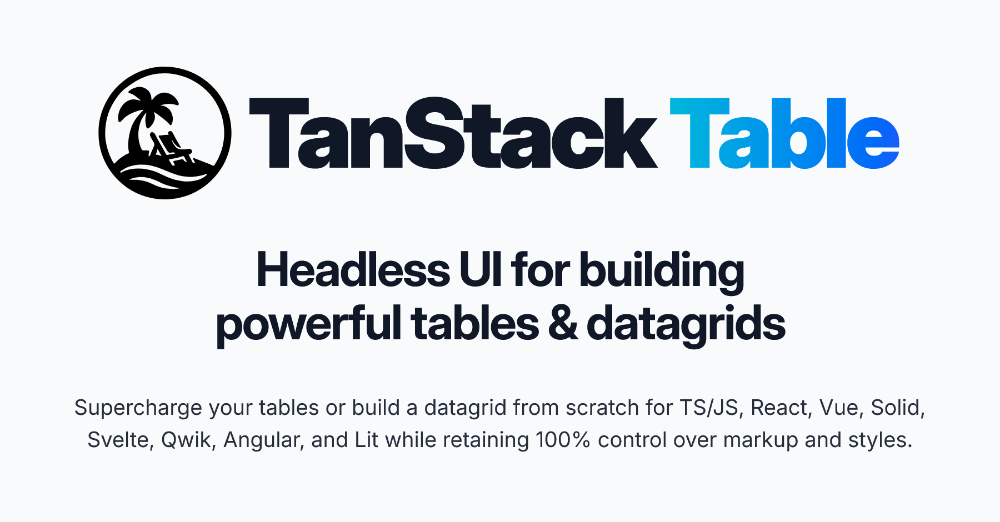

  

 

  

### [Become a Sponsor!](https://github.com/sponsors/tannerlinsley/)

# TanStack Table

> [!NOTE]
> You may know TanStack Table by the adapter names:
>
> - [Angular Table](https://tanstack.com/table/v8/docs/framework/angular/angular-table)
> - [Lit Table](https://tanstack.com/table/v8/docs/framework/lit/lit-table)
> - [Qwik Table](https://tanstack.com/table/v8/docs/framework/qwik/qwik-table)
> - [React Table](https://tanstack.com/table/v8/docs/framework/react/react-table)
> - [Solid Table](https://tanstack.com/table/v8/docs/framework/solid/solid-table)
> - [Svelte Table](https://tanstack.com/table/v8/docs/framework/svelte/svelte-table)
> - [Vue Table](https://tanstack.com/table/v8/docs/framework/vue/vue-table)

A headless table library for building powerful datagrids with full control over markup, styles, and behavior.

- Framework‑agnostic core with bindings for React, Vue & Solid
- 100% customizable — bring your own UI, components, and styles
- Sorting, filtering, grouping, aggregation & row selection
- Lightweight, virtualizable & server‑side friendly

### <a href="https://tanstack.com/table">Read the Docs →</a>

## Get Involved

- We welcome issues and pull requests!
- Participate in [GitHub discussions](https://github.com/TanStack/table/discussions)
- Chat with the community on [Discord](https://discord.com/invite/WrRKjPJ)
- See [CONTRIBUTING.md](./CONTRIBUTING.md) for setup instructions

## Partners

<table align="center">
  <tr>
    <td>
        <a href="https://www.coderabbit.ai/?via=tanstack&dub_id=aCcEEdAOqqutX6OS">
			<picture>
			  <source media="(prefers-color-scheme: dark)" srcset="https://tanstack.com/assets/coderabbit-dark-CMcuvjEy.svg" height="40" />
			  <source media="(prefers-color-scheme: light)" srcset="https://tanstack.com/assets/coderabbit-light-DVMJ2jHi.svg" height="40" />
			  
			</picture>        
		</a>
    </td>
    <td padding="20">
      <a href="https://www.cloudflare.com?utm_source=tanstack">
         <picture>
		  <source media="(prefers-color-scheme: dark)" srcset="https://tanstack.com/assets/cloudflare-white-DQDB7UaL.svg" height="60" />
		  <source media="(prefers-color-scheme: light)" srcset="https://tanstack.com/assets/cloudflare-black-CPufaW0B.svg" height="60" />
		  
		</picture>
      </a>
    </td>
    <td>
     <a href="https://ag-grid.com/react-data-grid/?utm_source=reacttable&utm_campaign=githubreacttable" style="display: flex; align-items: center; border: none;">
       <picture>
        <source media="(prefers-color-scheme: dark)" srcset="./media/ag-grid-dark.svg" height="40" />
        <source media="(prefers-color-scheme: light)" srcset="./media/ag-grid-light.svg" height="40" />
        
      </picture>
      </a>
    </td>
  </tr>
</table>

We're looking for TanStack Table Partners to join our mission! Partner with us to push the boundaries of TanStack Table and build amazing things together.

<a href="mailto:partners@tanstack.com?subject=TanStack Table Partnership"><b>LET'S CHAT</b></a>

## Explore the TanStack Ecosystem

- <a href="https://github.com/tanstack/config"><b>TanStack Config</b></a> – Tooling for JS/TS packages
- <a href="https://github.com/tanstack/db"><b>TanStack DB</b></a> – Reactive sync client store
- <a href="https://github.com/tanstack/devtools"><b>TanStack DevTools</b></a> – Unified devtools panel
- <a href="https://github.com/tanstack/form"><b>TanStack Form</b></a> – Type‑safe form state
- <a href="https://github.com/tanstack/pacer"><b>TanStack Pacer</b></a> – Debouncing, throttling, batching  
- <a href="https://github.com/tanstack/query"><b>TanStack Query</b></a> – Async state & caching
- <a href="https://github.com/tanstack/ranger"><b>TanStack Ranger</b></a> – Range & slider primitives
- <a href="https://github.com/tanstack/router"><b>TanStack Router</b></a> – Type‑safe routing, caching & URL state
- <a href="https://github.com/tanstack/router"><b>TanStack Start</b></a> – Full‑stack SSR & streaming
- <a href="https://github.com/tanstack/store"><b>TanStack Store</b></a> – Reactive data store
- <a href="https://github.com/tanstack/virtual"><b>TanStack Virtual</b></a> – Virtualized rendering

… and more at <a href="https://tanstack.com"><b>TanStack.com »</b></a>

<!-- USE THE FORCE LUKE -->
